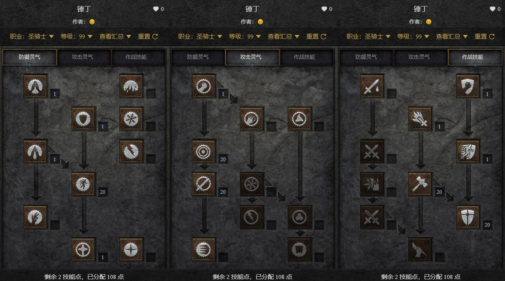
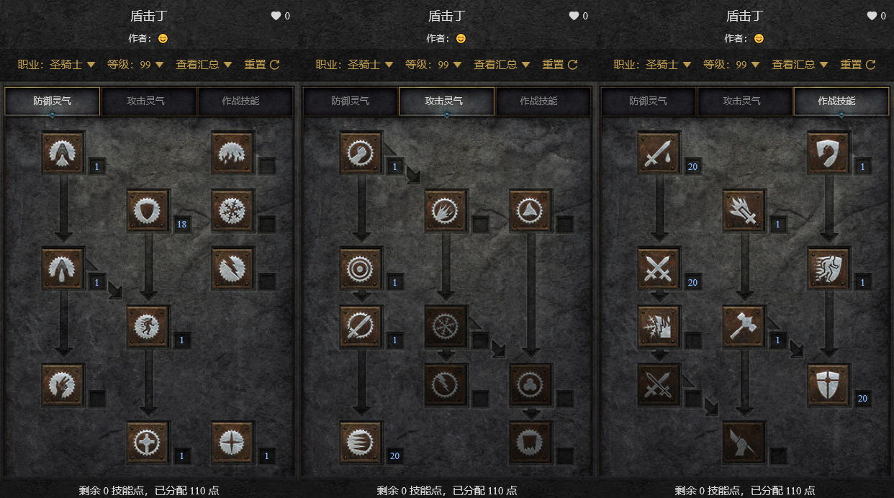
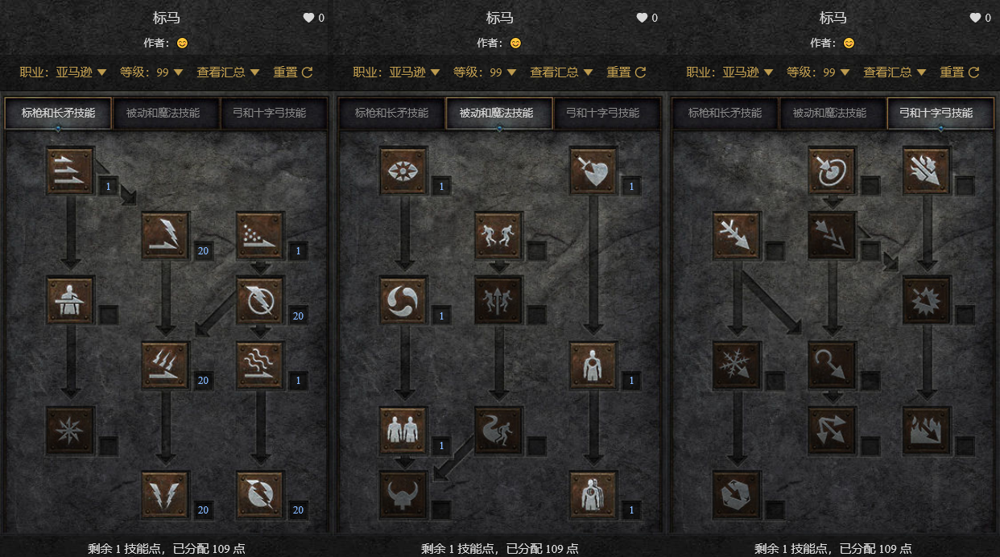
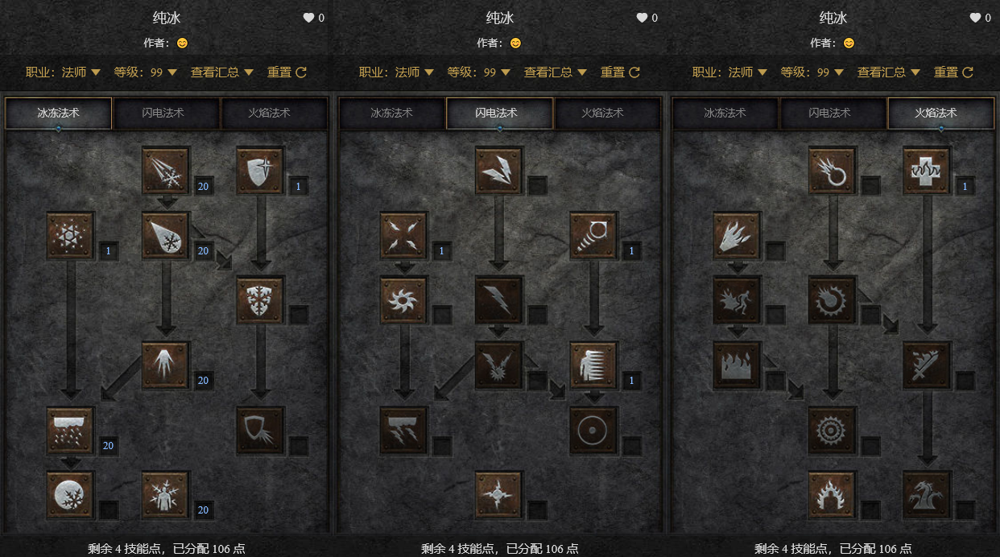
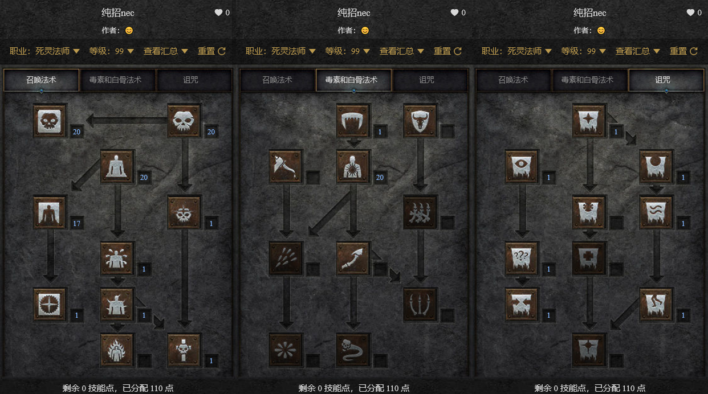
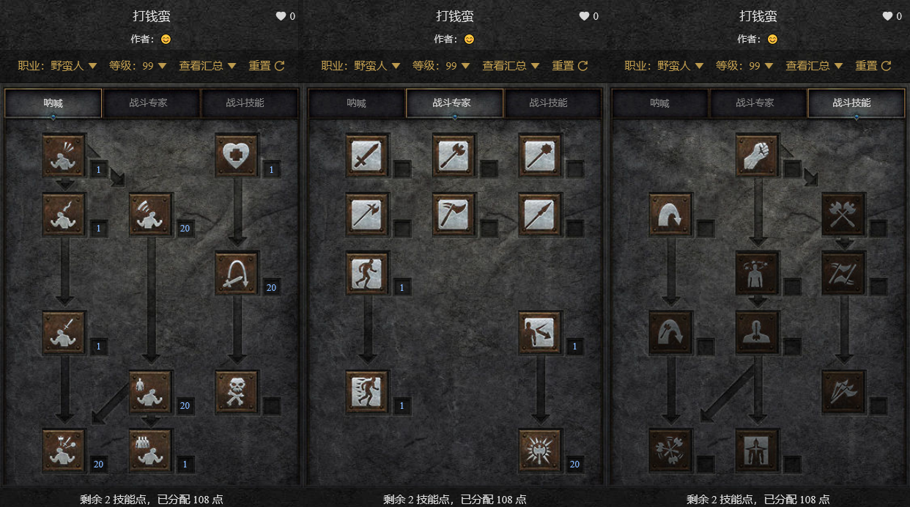

# D2RChar
**暗黑2重置版常见人物练法、加点、装备一览。** 功利向，都是为了刷装备或打boss。***粗斜体***为毕业或基本毕业装备，其他有的是mf用或过渡用。（所有技能加点图源自微信小程序***暗黑核***，功能无比齐全的暗黑2数据库，强烈推荐！）

## 锤丁

| 锤丁 | （普通祈祷佣兵，毁天灭地骑，施法档位最好125，最低75） |
| :---: | :---: |
| 加点 | 祝福之锤加满，祝福瞄准加满，活力加满，专注光环加满，神圣之盾尽量高，救赎1点，各过路技能1点 |
| 头 | ***军帽*** |
| 衣服 | 蛇皮、ire、***谜团*** |
| 武器 | 精神、***橡树*** |
| 盾牌 | ***精神*** |
| 项链 | 旭日东升、+技能fcr项链、***马拉*** |
| 手 | 运气、***法拳*** |
| 腰带 | ***蛛网*** |
| 鞋子 | 战旅、***水上飘*** |
| 戒指 | 乌鸦、婚戒、矮人、***乔丹***、***10fcr高属性戒指*** |
| 副手武器 | ***战争召唤*** |
| 副手盾牌 | ***精神*** |
| 护身符 | 基德、战斗技能板、地狱火炬、毁灭 |
| 佣兵头 | 吸血鬼、***安头*** |
| 佣兵武器 | ***眼光*** |
| 佣兵甲 | 都壳、背信、强制、***刚毅*** |
| 适合场景 | 3c、超市 |

## 双热

| 双热 | （噩梦力量佣兵，辅修盾击丁，狂砍一条街） |
| :---: | :---: |
| 加点 | 热忱加满，狂热光环加满，牺牲加满，神圣盾加满，反抗尽量高，盾击1点，救赎1点，救助光环1点，各过路技能1点 |
| 头 | ***cb头*** |
| 衣服 | 强制、***刚毅*** |
| 武器 | 屠夫、誓约、***悔恨*** |
| 盾牌 | 饰金盾、***流亡*** |
| 项链 | ***大君*** |
| 手 | 卓古拉、***安手*** |
| 腰带 | 吸血鬼、长串、***心结*** |
| 鞋子 | ***蚀肉*** |
| 戒指 | 矮人、***乌鸦***、***双吸戒指*** |
| 副手武器 | ***战争召唤*** |
| 副手盾牌 | ***精神*** |
| 护身符 | 基德、攻击技能板、地狱火炬、毁灭 |
| 佣兵头 | 吸血鬼、cb头、***安头*** |
| 佣兵武器 | 遵从、***丧钟*** |
| 佣兵甲 | 都壳、背信、强制、***刚毅*** |
| 适合场景 | 3c |

## 盾击丁

| 盾击丁 | （噩梦力量佣兵，或者不带，反正活不下来。。。不用单练，用双热的号即可） |
| :---: | :---: |
| 加点 | 热忱加满，狂热光环加满，牺牲加满，神圣盾加满，反抗尽量高，盾击1点，救赎1点，救助光环1点，各过路技能1点（同双热） |
| 头 | ***cb头*** |
| 衣服 | 强制、***谜团*** |
| 武器 | 天堂、***悔恨*** |
| 盾牌 | 饰金盾、***流亡*** |
| 项链 | ***大君*** |
| 手 | 卓古拉、***安手***（有流亡用安手，没有则必用卓古拉） |
| 腰带 | 心结、***雷神*** |
| 鞋子 | ***蚀肉*** |
| 戒指 | 矮人、***乌鸦***、***双吸戒指*** |
| 副手武器 | 偷取生命杖、***战争召唤*** |
| 副手盾牌 | ***精神*** |
| 护身符 | 基德、攻击技能板、地狱火炬、毁灭 |
| 佣兵头 | 吸血鬼、cb头、***安头*** |
| 佣兵武器 | 遵从、***眼光***（反正不能是丧钟，因为带诅咒会覆盖吸血诅咒） |
| 佣兵甲 | 都壳、背信、强制、***刚毅*** |
| 适合场景 | 超级大菠萝、6boss（绝对高效唯一人选） |

## 标马

| 标马 | （噩梦圣冰佣兵，或者不带，刷牛嘛。。不过可以卡佣兵bug，看你习惯喽） |
| :---: | :---: |
| 加点 | 闪电之怒加满，充能一击加满，闪电攻击加满，闪电球尽量高，威力一击尽量高，诱饵1点，刺入1点，穿透1点，各过路技能1点 |
| 头 | 女武神、迪勒瑞姆（引牛要操作滴）、***狮鹫*** |
| 衣服 | 和平、阿凯尼、奥玛斯、珠宝匠甲镶电珠、***谜团*** |
| 武器 | ***泰坦*** |
| 盾牌 | 暴风盾、***偏向盾镶电珠*** |
| 项链 | ***猫眼*** |
| 手 | ***技能攻速手套*** |
| 腰带 | ***剃刀之尾*** |
| 鞋子 | ***纱织*** |
| 戒指 | 玛那德、***乌鸦***、***双吸戒指*** |
| 副手武器 | 混乱聚气魔杖、和谐弓 |
| 副手盾牌 | 随便 |
| 护身符 | 基德、标枪技能板、地狱火炬、毁灭 |
| 佣兵头 | 吸血鬼、cb头、***安头*** |
| 佣兵武器 | 眼光、丧钟、***无限*** |
| 佣兵甲 | 都壳、背信、强制、石块、***刚毅*** |
| 适合场景 | 牛场（哞哞~） |

## 纯冰

| 纯冰 | （噩梦圣冰佣兵，纯冰是纯mf用，工具小妹儿） |
| :---: | :---: |
| 加点 | 冰风暴加满，冰尖柱加满，暴风雪加满，冰冷支配加满，冰弹尽量高，冰封装甲加1点，静态力场加1点，传送加1点，心灵传动加1点，温暖加1点，各过路技能1点 |
| 头 | ***军帽*** |
| 衣服 | ire、***7+*** |
| 武器 | 死亡深度、***眼球*** |
| 盾牌 | 暴风盾、***精神*** |
| 项链 | mf蓝戒指、***塔链*** |
| 手 | ***运气守护*** |
| 腰带 | 黄金裹腰、***塔拉夏腰*** |
| 鞋子 | ***战旅*** |
| 戒指 | mf蓝戒指、***拿各*** |
| 副手武器 | 海鸥、***阿里巴巴*** |
| 副手盾牌 | 灿烂、***押韵*** |
| 护身符 | 基德、冰技能板、地狱火炬、毁灭 |
| 佣兵头 | 吸血鬼、***安头*** |
| 佣兵武器 | 眼光、***丧钟*** |
| 佣兵甲 | 都壳、背信、强制、石块、***刚毅*** |
| 适合场景 | 古代、都虫、劳模、bug超市、刷钥匙、巴尔司机……（不是冰免就可以，地点选择最多的角色，因为自带传送，无敌好吧） |

## 纯招nec

| 纯招nec | （噩梦力量佣兵，喝杯茶先~） |
| :---: | :---: |
| 加点 | 骷髅复苏加满，骷髅支配加满，尸体爆炸加满，黏土石魔加满，支配石魔尽量高，伤害加深加1点，衰老诅咒加1点，复活怪物加1点，微暗灵视加1点，迷乱加1点，吸引加1点，召唤反抗加1点，各过路技能1点 |
| 头 | ***军帽*** |
| 衣服 | 蛇皮、塔格奥衣服、***谜团*** |
| 武器 | 精神、***骷髅王*** |
| 盾牌 | 精神、***侏儒*** |
| 项链 | +技能项链、***马拉*** |
| 手 | ***塔格奥手*** |
| 腰带 | 塔格奥腰、***蛛网*** |
| 鞋子 | ***骨骼行走*** |
| 戒指 | ***乌鸦***、***乔丹***、婚戒 |
| 副手武器 | 传送杖、***战争召唤*** |
| 副手盾牌 | 传送杖、***精神*** |
| 护身符 | 基德、召唤技能板、地狱火炬、毁灭 |
| 佣兵头 | 吸血鬼、***安头*** |
| 佣兵武器 | 眼光、丧钟、***无限*** |
| 佣兵甲 | 都壳、背信、强制、***刚毅*** |
| 适合场景 | 炸牛、喝茶玩暗黑、6boss辅助肉盾 |

## 打钱蛮

| 打钱蛮 | （噩梦力量佣兵，有钱的战士！有孔就镶#20加打钱。） |
| :---: | :---: |
| 加点 | 寻找物品加满，战斗狂嚎加满（或跳跃，看你喜欢唱歌还是跳舞），大叫加满，战斗体制加满，自然抵抗尽量高，战斗指挥加1点，铁布衫加1点，加速加1点，各过路技能1点 |
| 头 | ***不朽之王*** |
| 衣服 | ***财富*** |
| 武器 | 阿里巴巴、***6孔剑*** |
| 盾牌 | 阿里巴巴、***6孔剑*** |
| 项链 | +技能蓝黄橙项链、传送项链、***+钱项链*** |
| 手 | ***运气守护*** |
| 腰带 | ***黄金裹腰*** |
| 鞋子 | ***地狱阔步*** |
| 戒指 | ***双矮人*** |
| 副手武器 | 传送杖 |
| 副手盾牌 | 传送杖 |
| 护身符 | 基德、呐喊技能板、加钱板、地狱火炬、毁灭 |
| 佣兵头 | 盗贼、安头、***cb头*** |
| 佣兵武器 | 眼光、丧钟、***死亡呼吸*** |
| 佣兵甲 | 黑帝斯、背信、强制、***刚毅*** |
| 适合场景 | 3c（怎么还是你） |

## 参考攻略
- [仨X不等于四哥的全流派攻略，必看系列](https://tieba.baidu.com/p/6854129001)
- [版主大大的锤丁攻略](https://bbs.d.163.com/forum.php?mod=viewthread&tid=173961162)
- [勺子大大的盾丁攻略](https://bbs.d.163.com/forum.php?mod=viewthread&tid=173956844)
- [琉璃大大的纯招nec攻略](https://bbs.d.163.com/forum.php?mod=viewthread&tid=173960835)
- [菠萝大大的标马攻略](https://bbs.d.163.com/forum.php?mod=viewthread&tid=174003951)
- B站up主们的视频（[薛定谔的up主](https://space.bilibili.com/99084977)、[秋仲琉璃子不语](https://space.bilibili.com/8521296)、[战斗蜗牛](https://space.bilibili.com/53745747)、[Tony兔兔鸡](https://space.bilibili.com/12047071)、[爱迪生玩游戏](https://space.bilibili.com/629707370)）

## 结语
**这些职业和练法算是覆盖了基本所有需要刷的东西，符文、85场景、打钱、底材、6boss、DC、巴尔司机等等都有各自效率最高的角色，刷累了换个角色我又是一条好汉。等这七个练法都成型后就可以开始考虑娱乐玩法了，或者就退坑了。**
